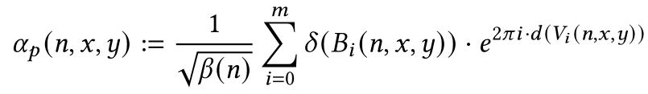
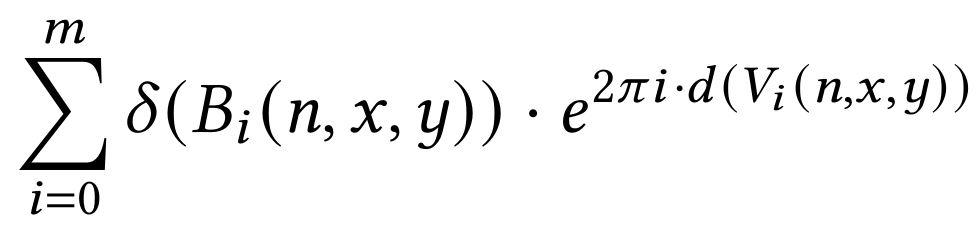

# Synthesis

This framework is based on the paper **A Case for Synthesis of Recursive Quantum Unitary Programs** [here](document/QSynth.pdf)

## Install
This framework is based on z3py, you can install it by
```
pip install z3-solver
```
run the command below to reproduce the results in paper.
```
python src/main.py
```
Four result program files, `FullAdder.py`, `GHZ.py`, `RippleAdder.py` and `QFT.py` will be synthesized. They are Qiskit functions that can generate the corresponding circuits. 

## Usage

We assume the users have some knowledge about the [Z3 Python API](https://ericpony.github.io/z3py-tutorial/guide-examples.htm) to give specifications to QSynth. Please read the [z3py tutorial](https://ericpony.github.io/z3py-tutorial/guide-examples.htm) if you have no knowledge about it.

To use QSynth, first import z3tool and the necessary functions form QSynth
```python
from z3tool import *
from qsynth import synthesis, StandardGateSet, PPSA
```
Function `synthesis` is used to generate target programs given the specification. `StandardGateSet` is the gateset which QSynth uses for synthesis. Class `PPSA` is used to give specification.

The function `synthesis` needs three inputs:
```python
synthesis(amplitude, gateset,  hypothesis=lambda n,x,y:True)
```
The input `gateset` suggests the gate set which QSynth search during the synthesis. Inputs `amplitude` and `hypothesis` are the hypothesis-amplitude specification (see the paper for their meaning).

The input `hypothesis` is a function from three z3py Boolean variables to one z3py Boolean Variable (or True and False), indicating the hypothesis specification.

The input `amplitude` should be a `PPSA` variable (a PPSA function as discussed in paper), indicating the amplitude function in the specification. A PPSA function should be in the form

A `PPSA` variable is created by two functions `beta` and `pathsum`
```python
PPSA(beta, phaseSum)
```
`beta` should be a function from a z3py `BitVec(32)` variable to a z3py `BitVec(32)` variable, indicating the function \beta(n) in PPSA's definition. For example
```
beta=lambda n: LShR(2, n)
```
where `LShR` is the unsigned right shift operators in z3py.

`phaseSum` should be a function that recieves three z3py `BitVec(32)` variables as inputs and return a list of tuple `[(B0,V0),(B1,V1),...,(Bi, Vi)]`, indicating the term

in PPSA's definition. Here `V0,V1,...,Vi` should be three z3py `BitVec(32)` variables. `B0,B1,...,Bi` should be the product of `bvalue(b)` where `bvalue` is a function provided by QSynth and `b` is a z3py Boolean variable. For example, a valid phaseSum function is shown below
```python
def foo(n,x,y):
    B0 = bvalue(x == y)
    V0 = x + 1
    B1 = bvalue(Or(x > 3, y > 3))
    V1 = n*y
    return [(B0,V0), (B1,V1)]
```

We also provide several useful api for writing function `beta` and `phaseSum`:

- `Equal(a,b)`: equals to `bvalue(a==b)` and can be used to construct `B0,B1,...,Bi`
- `BVref(a : BitVec(32), b : BitVec(32)) -> BitVec(32)`: returns the `b`th bit of `a` (0 or 1 with type BitVec(32)). 
- `BVtrunc(vec, upper, lower)->BitVec(32)`:return vec[lower: upper] (include upper) .
    ```
    BVtrunc(01101, 2, 1) = 00010 (01 "10" 1)
    BVtrunc(01101, 3, 2) = 00011 (0 "11" 01)
    ```
- `bv(n:int)->BitVec(32)`: transform a python integer `n` to a z3py BitVec(32) vvariable.

### GHZ Example

The specification is given as

```python
def GHZamplitude(n, x, y):
    Eq = Equal(BVtrunc(y,n), bv(0)) | Equal(BVtrunc(y,n), (bv(1)<<(n+1)) -1)
    return [(Eq, bv(0))]

GHZspec = PPSA(beta=lambda n: 2, phaseSum=GHZamplitude)
```

Synthesize the target program

```python
prog = synthesis(spec, StandardGateSet, hypothesis = lambda n,x,y : x==bv(0))
```

Write the result to a file `GHZ.py`. The parameter `GHZ` for the method `toQiskit` sets the name of the function which is written into the file.

```python
filewrite(prog.toQiskit('GHZ'), 'GHZ.py')
```